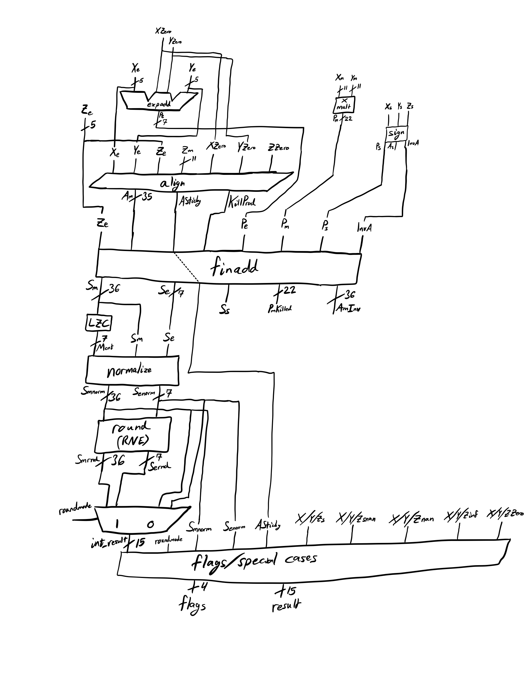
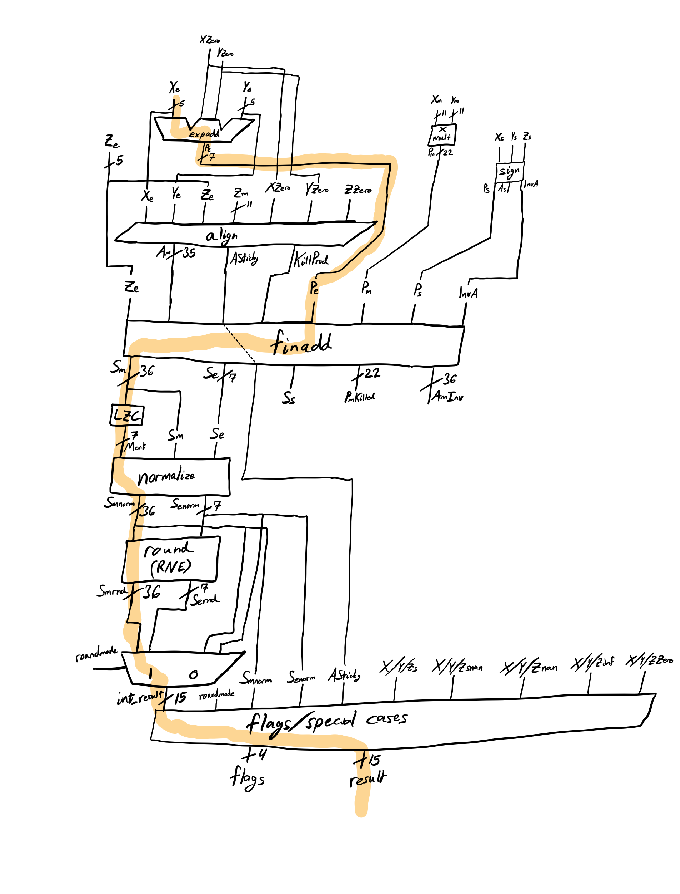

[](https://classroom.github.com/a/TAzrG3QF)
# HSCAF25-project

## Introduction
**Completed FMA Block Diagram:**  


**Explanation of Architecture:**  
  The design is split into several modules:

- *fma16.sv*: Top level module which takes inputs, instantiates the other modules, and outputs the result and flags.
- *unpack.sv*: Splits x, y, z inputs into separate signals for their exponent, mantissa, and sign. It also outputs whether the inputs are special cases: subnormal, zero, infinity, NaN, and Signaling NaN.
- *fmaexpadd.sv*: Sums exponents of X and Y, given they are non-zero, and subtracts bias to output Pe.
- *fmamult.sv*: Multiplies mantissas of X and Y and ouputs to Pm.
- *fmasign.sv*: Determines the sign of the product Ps. Has skeleton code to support subtraction and output based on that, but that is not used here.
- *fmaalign.sv*: Shifts Zm to align with Pm for addition and outputs shift to Zmshift.
- *fmaadd.sv*: Sums Product and Z to produce Ss, Se, and Sm. PmKilled is not used, as this FMA utilizes an lzc.
- *lzc.sv*: Leading zero counter; counts the number of leading zeroes in Sm and outputs count to Mcnt. Normalization happens afterward in the top module, producing Smnorm and Senorm.
- *rne.sv*: Performs Round to Nearest Even on normalized sum and outputs Smrnd and Sernd. Top module selects between RNE output and Round to Zero to pass as int_result.
-*fmaflags.sv*: Generates flags and modifies int_result based on special cases, outputting to result.

**Summary of Major Optimizations:**  
  No significant optimization was performed for this FMA. The Round to Zero option may allow for faster computation of the result.

---

## Test Results
The design is able to pass every non-rounding-mode test aside from baby_torture.tv, which may be due to usage of operation control signals that are not required for this project. In the fma_special tests, some of the flags are incorrect, and I was not able to determine the cause.

**Lint Status:**  
  The Verilator linter catches a small error with undefined bit widths of the summing values in fmaexpadd.sv. This, however, has shown no issue when it comes to HLS.

**Test Coverage:**  
| Test Name | Status |
|-----------|--------|
| fmul_0    | Passed |
| fmul_1    | Passed |
| fmul_2    | Passed |
| fadd_0    | Passed |
| fadd_1    | Passed |
| fadd_2    | Passed |
| fma_0     | Passed |
| fma_1     | Passed |
| fma_2     | Passed |
| fma_special_rz     | Passed |
| fma_special_rne    | Passed |
| baby_torture     | Failed |

**Results on Torture.tv:**  
  The design failed *baby_torture.sv*. Stated above, this may be due to features absent in our design that are not required for the project.

---

## Synthesis Results
Synthesis results are stored in the *synthDC* folder.

**Hierarchical Area Report:**  
  The total area of the fma16 is 12213.7402. The module with the largest footprint is *DW_mult_uns*, with an area of 2020.7595 occupying 16.5% of the total area.

**Timing Report:**  
  My logic was clocked at 485 MHz, giving a data required time of 2.061856 ns. The arrival time was 2.061687 ns, giving a slack of 0.000169 ns and meeting the requirement.

**Critical Path Annotated on Block Diagram:**  
   Critical path is through the rounding unit.
   

**Power Report:**  
  | Internal Power | Switching Power | Leakage Power | Total Power |
  |----------------|-----------------|---------------|-------------|
  | 1.828588 mW    |  1.981185 mW    | 7.414545e+03 nW |      3.817193 mW|

**Energy-Delay Product (EDP):**  
  ```
  E × D = (P × D) × D = 3.817193 mW × 2.061687 ns × 2.061687 ns
  = 1.62252e-20 Js
  ```

---

## Project Management
Due to poor time management decisions, all of the work on the project was completed during the final week.

**Weekly Time Spent Table:**

| Week (Monday) | Hours |
|---------------|-------|
| 1 (10/27)     | 0     |
| 2 (11/3)      | 0     |
| 3 (11/10)     | 0     |
| 4 (11/17)     | 0     |
| 5 (11/24)     | 0     |
| 6 (12/1)      | 36    |

**Reflections on lessons for future hardware design projects:**  
  The intense time crunch of this week has taught me two very powerful lessons: to prioritize steady progress on longer-term projects and to make sure smaller components are fully tested and verified before further integration. For me, this project was a panicked attempt at throwing everything together as quickly as possible, resulting in a massive debugging headache that I was not able to fully solve. Were I to do this again, I would space out my work over a much longer time, and I would have a much stronger focus on verifying individual components, rather than just the full product.

---

## Time spent: Planning, coding, debugging, user tests, optimizing, report
Due to the rushed nature of this, very little time was spent planning or optimizing. Coding took roughly 8 hours of the time, and the report took roughly two hours. Testing and debugging, on the other hand, took the entire rest of my time spent on the project, likely totalling over 30 hours in these few days.

---

## Conclusion
I believe that I made a strong attempt at a fully-functional FMA, and was able to gain a much stronger understanding of floating-point number storage and arithmetic. The FMA is not completely finished, but it can still correctly compute the majority of the tests sets given.
